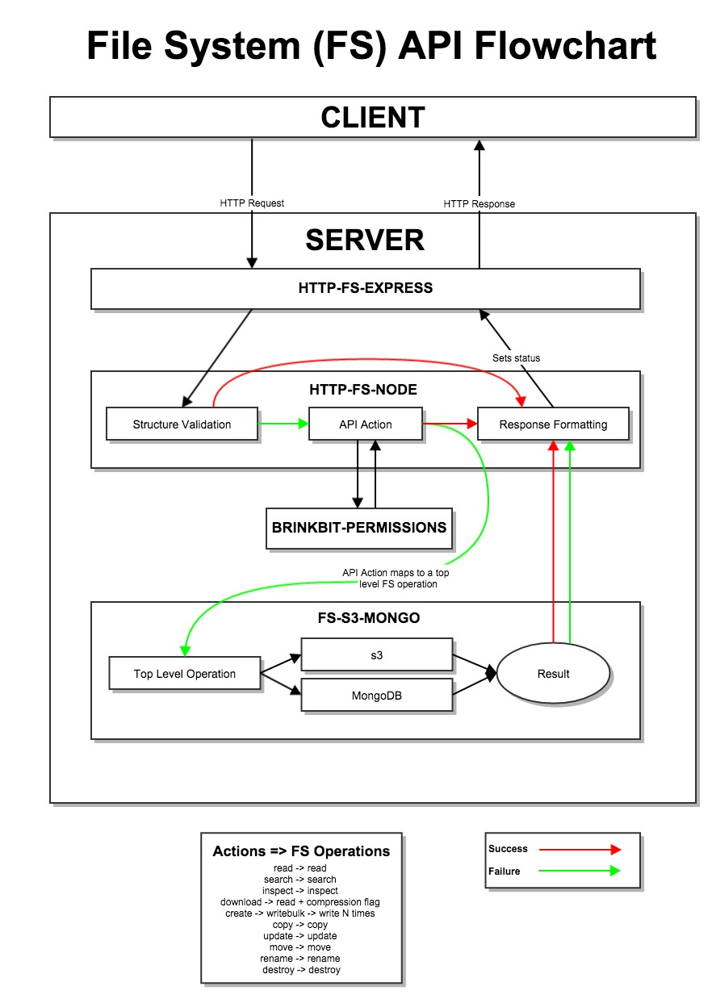

# fs-s3-mongo
Wrapper for the s3 client and mongo interface for use with the http-fs-node module

# Contribution

The guide for contributing to any of our repositories can be found [here](https://github.com/Brinkbit/brinkbit-style-es6#contributing).
